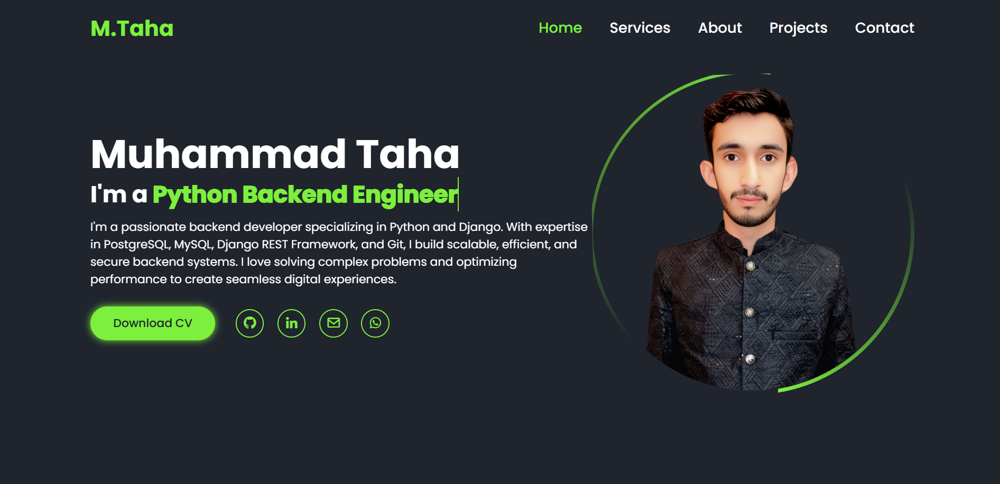
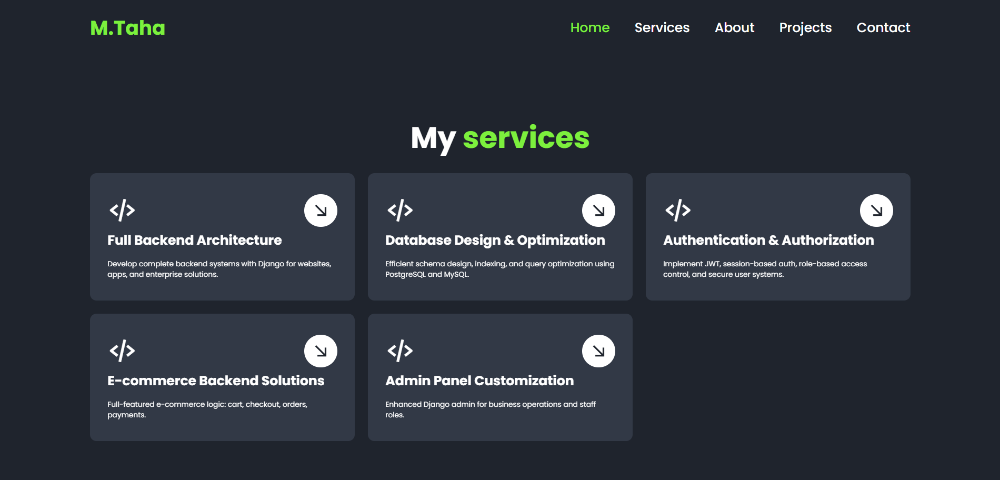
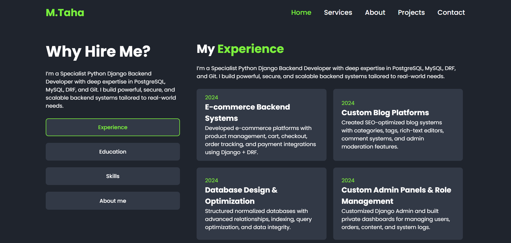
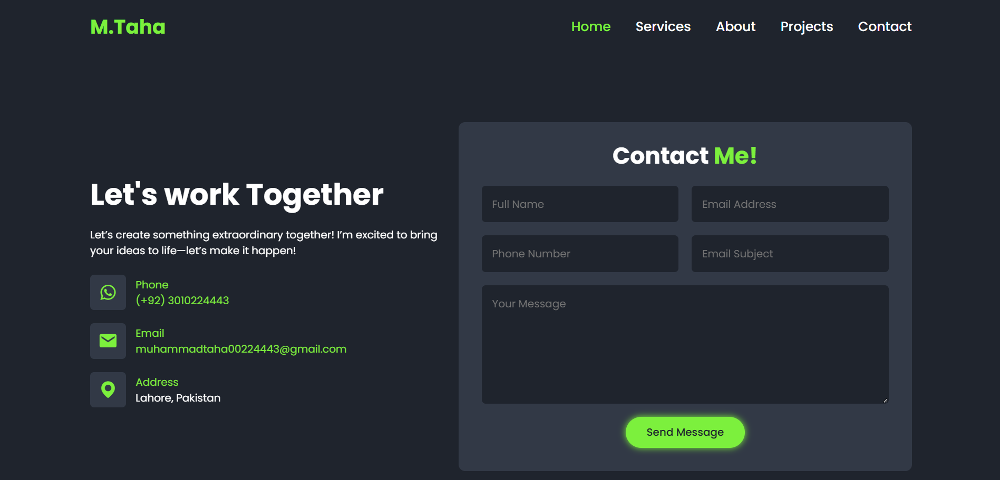

# Portfolio Website

 <!-- Add your screenshot if available -->




## A responsive personal portfolio website built with HTML, CSS, and JavaScript.

## 🔗 Live Demo
[View Portfolio](https://muhammadtaha0022.github.io/PortFolio-frontend/) <!-- Update with your actual URL -->

## ✨ Features
- 📱 Fully responsive design
- 🎨 Clean modern UI
- ✨ Smooth animations
- 📂 Project showcase section
- 📧 Contact form
- 🌓 Dark/light mode (optional)

## 🛠 Technologies


## 🚀 Quick Start

1. **Clone the repository**
   ```bash
   git clone https://github.com/muhammadtaha0022/PortFolio-frontend.git

2. **Navigate to project directory**
   ```
   cd PortFolio-frontend
   ```
3. Open in browser

   * Double-click index.html or

   * Use VS Code Live Server extension

# 🖌️ Customization
### Edit these files to personalize:
* index.html - Update your personal info

* assets/css/style.css - Change colors, fonts

* assets/js/main.js - Modify projects data
# 📜 License
* MIT License - Feel free to use as your own portfolio template.


## 📞 Contact Information

### Direct Contacts
- **Mobile:** [+92 301 0224443](tel:+923010224443)
- **WhatsApp:** [+92 301 0224443](https://wa.me/923010224443)
- **Email:** [muhammadtaha00224443@gmail.com](mailto:muhammadtaha00224443@gmail.com)

### Professional Profiles
- **LinkedIn:** [Muhammad Taha](https://www.linkedin.com/in/muhammad-taha-taha)
- **GitHub:** [muhammadtaha0022](https://github.com/muhammadtaha0022)
